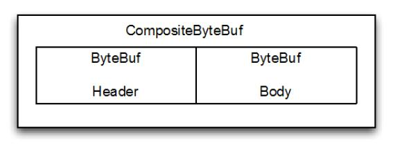

ByteBuf - 字节数据的容器
====

网络进行交互时，需要以字节码发送/接收数据。由于各种原因，一个高效、方便、易用的数据接口是必须的，而 Netty 的 ByteBuf 满足这些需求。

ByteBuf 是一个很好的经过优化的数据容器，我们可以将字节数据有效的添加到 ByteBuf 中或从 ByteBuf 中获取数据。ByteBuf 有2部分：一个用于读，一个用于写。我们可以按顺序的读取数据，并且可以跳到开始重新读一遍。所有的数据操作，我们只需要做的是调整读取数据索引和再次开始通过 get() 方法进行读操作。

###ByteBuf 如何在工作？

写入数据到 ByteBuf 后，writerIndex（写入索引）增加。开始读字节后，readerIndex（读取索引）增加。你可以读取字节，直到写入索引和读取索引处理相同的位置，ByteBuf 变为不可读。当访问数据超过数组的最后位，则会抛出 IndexOutOfBoundsException。

调用 ByteBuf 的 "read" 或 "write" 开头的任何方法都会提升 相应的索引。另一方面，"set" 、 "get"操作字节将不会移动指数；他们只操作相关的通过参数传入方法的索引。

ByteBuf 的默认最大容量限制是 Integer.MAX_VALUE，写入时若超出这个值将会导致一个异常。

ByteBuf 类似于一个字节数组，最大的区别是读和写的索引可以用来控制对缓冲区数据的访问。下图显示了一个容量为16的空的 ByteBuf  的布局和状态，writerIndex 和 readerIndex 都在索引位置 0 ：

Figure 5.1 A 16-byte ByteBuf with its indices set to 0

###ByteBuf 使用模式

####HEAP BUFFER(堆缓冲区)

最常用的类型是 ByteBuf 将数据存储在 JVM 的堆空间，这是通过将数据存储在数组的实现。堆缓冲区可以快速分配，当不使用时也可以快速释放。它还提供了直接访问数组的方法，通过 ByteBuf.array() 来获取 byte[]数据。这种方法，清单5.1中示出，是非常适合的情况下
你必须处理遗留数据。

Listing 5.1 Backing array

	ByteBuf heapBuf = ...;
    if (heapBuf.hasArray()) {				//1
        byte[] array = heapBuf.array();		//2
        int offset = heapBuf.arrayOffset() + heapBuf.readerIndex();				//3
        int length = heapBuf.readableBytes();//4
        handleArray(array, offset, length); //5
    }

1.检查 ByteBuf 是否有支持数组。

2.如果这样得到的引用数组。

3.计算第一字节的偏移量。

4.获取可读的字节数。

5.使用数组，偏移量和长度作为调用方法的参数。

注意：

* 访问非堆缓冲区 ByteBuf 的数组会导致UnsupportedOperationException， 可以使用 ByteBuf.hasArray()来检查是否支持访问数组。
* 这个用法与 JDK 的 ByteBuffer 类似

####DIRECT BUFFER(直接缓冲区)

“直接缓冲区”是另一个 ByteBuf 模式。对象的所有内存分配发生在
堆，对不对？好吧，并非总是如此。在 JDK1.4 中被引入 NIO 的ByteBuffer 类允许一个 JVM 实现通过本地调用分配内存，其目的是

* 通过免去中间交换的内存拷贝, 提升IO处理速度;
直接缓冲区的内容可以驻留的正常垃圾回收以外
堆。
* DirectBuffer 在 -XX:MaxDirectMemorySize=xxM大小限制下, 使用 Heap 之外的内存, GC对此”无能为力”,也就意味着规避了在高负载下频繁的GC过程对应用线程的中断影响.(详见<http://docs.oracle.com/javase/7/docs/api/java/nio/ByteBuffer.html.>)

这就解释了为什么“直接缓冲区”是理想的 通过 socket 实现数据传输。如果你的数据是包含在堆中分配的缓冲区，JVM 实际上在通过 socket 发送之前将复制您的缓冲区到直接缓冲区。

但是直接缓冲区的缺点是在分配内存空间和释放内存时比堆缓冲区更复杂，另外一个缺点是如果是与传统的代码工作;因为数据不是在堆上，你可能要作出一个副本，如下：

Listing 5.2 Direct buffer data access

	ByteBuf directBuf = ...
    if (!directBuf.hasArray()) {			//1
        int length = directBuf.readableBytes();//2
        byte[] array = new byte[length];	//3
        directBuf.getBytes(directBuf.readerIndex(), array);		//4	
        handleArray(array, 0, length);  //5
    }

1.检查 ByteBuf 不是由数组支持。如果不是，这是一个直接缓冲液。

2.获取可读的字节数

3.分配一个新的数组来保存字节

4.字节复制到数组

5.调用一些参数是 数组，偏移量和长度 的方法

显然，这涉及到比使用支持数组多做一些工作。因此，如果你知道事先在容器中的数据作为一个数组进行访问，你可能更愿意使用堆内存。

####COMPOSITE BUFFER(复合缓冲区)

最后一种模式是复合缓冲区，我们可以创建多个不同的 ByteBuf，然后提供一个这些 ByteBuf 组合的视图。复合缓冲区就像一个列表，我们可以动态的添加和删除其中的 ByteBuf，JDK 的 ByteBuffer 没有这样的功能。

Netty 提供了 ByteBuf 的子类 CompositeByteBuf 类来处理复合缓冲区，CompositeByteBuf 只是一个视图。

*警告*

*CompositeByteBuf.hasArray() 总是返回 false，因为它可能包含一些直接或间接的不同类型的 ByteBuf。*

例如，一条消息由 header 和 body 两部分组成，将 header 和 body 组装成一条消息发送出去，可能 body 相同，只是 header 不同，使用CompositeByteBuf 就不用每次都重新分配一个新的缓冲区。下图显示CompositeByteBuf 组成 header 和 body：

Figure 5.2 CompositeByteBuf holding a header and body

下面代码显示了使用 JDK 的 ByteBuffer 的一个实现。两个 ByteBuffer 的数组创建保存消息的组件，第三个创建用于保存所有数据的副本。

Listing 5.3 Composite buffer pattern using ByteBuffer

    // 使用数组保存消息的各个部分
    ByteBuffer[] message = { header, body };

    // 使用副本来合并这两个部分
    ByteBuffer message2 = ByteBuffer.allocate(
            header.remaining() + body.remaining());
    message2.put(header);
    message2.put(body);
    message2.flip();

这种做法显然是低效的;分配和复制操作是不是最佳的，操纵阵列使代码尴尬。

下面看下 CompositeByteBuf 的版本

Listing 5.4 Composite buffer pattern using CompositeByteBuf

    CompositeByteBuf messageBuf = ...;
	ByteBuf headerBuf = ...; // 可以支持或直接
	ByteBuf bodyBuf = ...; // 可以支持或直接
    messageBuf.addComponents(headerBuf, bodyBuf);
    // ....
    messageBuf.removeComponent(0); // 移除头	//2

    for (int i = 0; i < messageBuf.numComponents(); i++) {						//3
        System.out.println(messageBuf.component(i).toString());
    }

1.追加 ByteBuf 实例的 CompositeByteBuf

2.删除  索引1的 ByteBuf

3.遍历所有 ByteBuf 实例。

清单5.4 所示，你可以简单地把一个 CompositeByteBuf 作为一个迭代
收集器。因为 CompositeByteBuf 不允许到间接数组访问，数据访问，
见清单5.5，类似于直接缓冲区模式：

Listing 5.5 Access data

	CompositeByteBuf compBuf = ...;
    int length = compBuf.readableBytes();	//1
    byte[] array = new byte[length];		//2
    compBuf.getBytes(compBuf.readerIndex(), array);	//3
    handleArray(array, 0, length);	//4

1.得到的可读的字节数。

2.分配一个新的数组,为可读字节长度。

3.读取字节到数组

4.使用数组，偏移量和长度作为参数

Netty 尝试使用 CompositeByteBuf 优化 socket I/O 操作，消除
当可能发生的是与 JDK 实现的性能和内存使用情况的问题。虽然是在Netty 的核心代码进行这种优化，并且是不暴露的，人们应该意识到其影响。

*CompositeByteBuf API*

*CompositeByteBuf 提供了大量的附加功能超出了它所继承的 ByteBuf。请参阅的 Netty 的 Javadoc 文档 API。*

