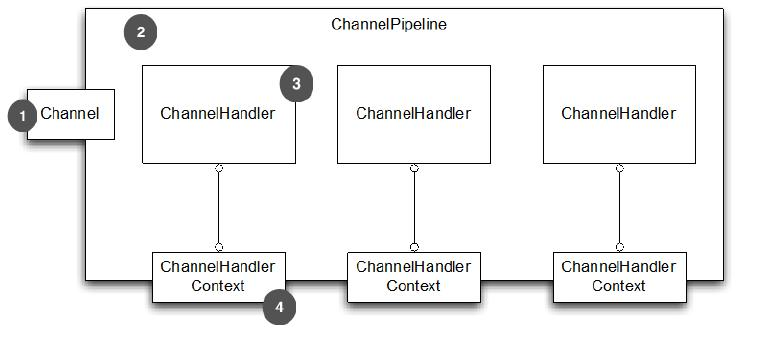

ChannelHandlerContext  
====

接口 ChannelHandlerContext 代表 ChannelHandler 和ChannelPipeline 之间的关联,并在 ChannelHandler 添加到 ChannelPipeline 时创建一个实例。ChannelHandlerContext 的主要功能是管理通过同一个 ChannelPipeline 关联的 ChannelHandler 之间的交互。

ChannelHandlerContext 有许多方法,其中一些也出现在 Channel 和ChannelPipeline 本身。然而,如果您调用这些方法在一个 Channel 或ChannelPipeline 实例他们传播在整个 pipeline 。相比之下,一样的
上的方法在 ChannelHandlerContext 仅在当前 ChannelHandler 开始并传播到相关管道中的下一个有处理事件的能力 ChannelHandler 。

ChannelHandlerContext API 总结如下：

Table 6.10 ChannelHandlerContext API

名称 | 描述
------ | ----
bind | Request to bind to the given SocketAddress and return a ChannelFuture.
channel  | Return the Channel which is bound to this instance.
close  | Request to close the Channel and return a ChannelFuture.
connect | Request to connect to the given SocketAddress and return a ChannelFuture.
deregister  | Request to deregister from the previously assigned EventExecutor and return a ChannelFuture.
disconnect |  Request to disconnect from the remote peer and return a ChannelFuture.
executor |  Return the EventExecutor that dispatches events.
fireChannelActive  | A Channel is active (connected).
fireChannelInactive |  A Channel is inactive (closed).
fireChannelRead |  A Channel received a message.
fireChannelReadComplete | Triggers a channelWritabilityChanged event to the next
ChannelInboundHandler.
handler  | Returns the ChannelHandler bound to this instance.
isRemoved  | Returns true if the associated ChannelHandler was removed from the ChannelPipeline.
name  |  Returns the unique name of this instance.
pipeline  | Returns the associated ChannelPipeline.
read  | Request to read data from the Channel into the first inbound buffer. Triggers a channelRead event if successful and notifies the handler of channelReadComplete.
write  | Request to write a message via this instance through the pipeline.

其他注意注意事项：

* ChannelHandlerContext 与 ChannelHandler 的关联从不改变，所以缓存的引用是安全的。
* 正如我们前面指出的,ChannelHandlerContext 方法比在其他类中同样的方法,包括一个短事件流。这样可以尽可能提供最好的性能。

### 使用 ChannelHandler 

本节，我们将说明使用 ChannelHandlerContext ，以及ChannelHandlerContext, Channel 和 ChannelPipeline 这些方法中的不同表现。下图展示了 ChannelPipeline, Channel,
ChannelHandler 和 ChannelHandlerContext  的关系

1. Channel 绑定到 ChannelPipeline
2. ChannelPipeline 绑定到 包含 ChannelHandler 的 Channel 
3. ChannelHandler
4. 当添加 ChannelHandler 到 ChannelPipeline 时，ChannelHandlerContext 被创建

Figure 6.3 Channel, ChannelPipeline, ChannelHandler and ChannelHandlerContext

下面展示了， 从 ChannelHandlerContext 获取到 Channel  的引用，通过调用 Channel 上的 write() 方法来处罚一个 写事件到管道的流中

Listing 6.6 Accessing the Channel from a ChannelHandlerContext

    ChannelHandlerContext ctx = context;
    Channel channel = ctx.channel();  //1
    channel.write(Unpooled.copiedBuffer("Netty in Action",
            CharsetUtil.UTF_8));  //2

1. 得到与  ChannelHandlerContext 关联的  Channel 的引用 
2. 通过 Channel 写缓存

下面展示了 从 ChannelHandlerContext 获取到 ChannelPipeline 的相同示例

Listing 6.7 Accessing the ChannelPipeline from a ChannelHandlerContext

    ChannelHandlerContext ctx = context;
    ChannelPipeline pipeline = ctx.pipeline(); //1
    pipeline.write(Unpooled.copiedBuffer("Netty in Action", CharsetUtil.UTF_8));  //2

1. 得到与  ChannelHandlerContext 关联的 ChannelPipeline 的引用 
2. 通过 ChannelPipeline 写缓存

流在两个清单6.6和6.7是一样的,如图6.4所示。重要的是要注意,虽然write() 调用 Channel 或 ChannelPipeline 操作传播事件在整个管道,在 ChannelHandler 级别运动从一个处理程序到下一个是通过在 ChannelHandlerContext 调用的

1. 事件传递给 ChannelPipeline 的第一个 ChannelHandler
2. ChannelHandler 通过关联的 ChannelHandlerContext 传递事件给 ChannelPipeline 中的 下一个
3. ChannelHandler 通过关联的 ChannelHandlerContext 传递事件给 ChannelPipeline 中的 下一个

Figure 6.4 Event propagation via the Channel or the ChannelPipeline

为什么你想从在 ChannelPipeline 一个特定的点开始传播一个事件?

* 通过减少 ChannelHandler 不感兴趣的事件的传递，从而减少开销
* 排除具体处理程序感兴趣的处理

调用从一个特定的 ChannelHandler 开始处理，必须引用与 ChannelHandler 之前关联的 ChannelHandlerContext 。ChannelHandlerContext 将调用 ChannelHandler 与之关联的其他 。

下面展示了使用场景

Listing 6.8 Events via ChannelPipeline

	ChannelHandlerContext ctx = context;
	ctx.write(Unpooled.copiedBuffer("Netty in Action",              CharsetUtil.UTF_8));

1. 获得 ChannelHandlerContext 的引用
2. write() 将会发送缓存到下一个 ChannelHandler

如下所示,消息流经 ChannelPipeline 从下一个 ChannelHandler 开始,绕过前面的。 

1. ChannelHandlerContext 方法调用
2. 事件发送到了下一个 ChannelHandler
3. 当 ChannelHandler 是最后一个时，事件从 ChannelPipeline 移除

Figure 6.5 Event flow for operations triggered via the ChannelHandlerContext

我们刚刚描述的用例是一种常见的,尤其是用于调用特定 ChannelHandler操作实现。

###  ChannelHandler 和 ChannelHandlerContext 的高级用法

我们看到清单6.6你可以得到封闭的 ChannelPipeline 引用，通过调用ChannelHandlerContext的 pipeline() 方法。这使得可以在运行时操作 pipeline 的 ChannelHandler ，以及可以被利用来实现一些复杂的需求,例如,添加一个 ChannelHandler 到 pipeline 来支持动态协议改变。

其他高级用例可以实现通过保持一个 ChannelHandlerContext 引用供以后使用,这可能发生在任何 ChannelHandler 方法,甚至来自不同的线程。清单6.9显示了此模式被用来触发一个事件。

Listing 6.9 ChannelHandlerContext usage

	public class WriteHandler extends ChannelHandlerAdapter {
	
	    private ChannelHandlerContext ctx;
	
	    @Override
	    public void handlerAdded(ChannelHandlerContext ctx) {
	        this.ctx = ctx;		//1
	    }
	
	    public void send(String msg) {
	        ctx.writeAndFlush(msg);  //2
	    }
	}

1. 存储 ChannelHandlerContext 的引用供以后使用
2. 使用之前存储的 ChannelHandlerContext 来发送消息

因为 ChannelHandler 可以属于多个 ChannelPipeline ,它可以绑定多个 ChannelHandlerContext 实例。然而,ChannelHandler 用于这种用法必须添加 `@Sharable` 注解。否则,试图将它添加到多个
ChannelPipeline 将引发一个异常。此外,它必须是线程安全的和安全的使用多个同时的通道(比如,连接)。

清单6.10显示了此模式的正确实现。

Listing 6.10 A shareable ChannelHandler

	@ChannelHandler.Sharable			//1
	public class SharableHandler extends ChannelInboundHandlerAdapter {
	
	    @Override
	    public void channelRead(ChannelHandlerContext ctx, Object msg) {
	        System.out.println("channel read message " + msg);
	        ctx.fireChannelRead(msg);  //2
	    }
	}

1. 添加 @Sharable 注解
2. 日志方法调用， 并专递到下一个 ChannelHandler

上面这个 ChannelHandler 实现符合所有包含在多个管道的要求;它 通过`@Sharable` 注解，并不持有任何状态。清单6.11中,另一方面,会造成问题。

Listing 6.11 Invalid usage of @Sharable

	@ChannelHandler.Sharable  //1
	public class NotSharableHandler extends ChannelInboundHandlerAdapter {
	    private int count;
	
	    @Override
	    public void channelRead(ChannelHandlerContext ctx, Object msg) {
	        count++;  //2
	
	        System.out.println("inboundBufferUpdated(...) called the "
	        + count + " time");  //3
	        ctx.fireChannelRead(msg);
	    }
	
	}

1. 添加 @Sharable
2. count 字段递增
3. 日志方法调用， 并专递到下一个 ChannelHandler

这段代码的问题是状态:一个实例变量保持了方法调用的计数。将这个类的一个实例添加到 ChannelPipeline 并发访问通道时很可能产生错误。(当然,这个简单的例子中可以通过修改纠正在 channelRead() 上添加 synchronized )

总之,使用`@Sharable`的话，要确定 ChannelHandler 是现成安全的。

*为什么共享 ChannelHandler*

*常见原因是安装一个 ChannelHandler 在多个 ChannelPipelines 跨多个渠道为了收集统计数据。*

我们的讨论 ChannelHandlerContext 及与其他框架组件关系的 到此结束。接下来我们将解析 Channel 状态模型,准备仔细看看ChannelHandler 本身。