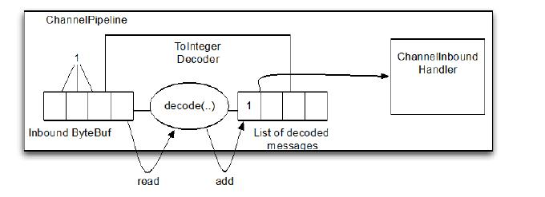
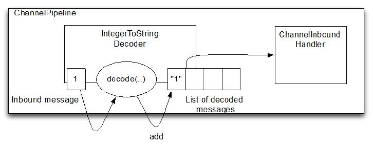

Decoder(解码器)
====

本节，会提供几个类用于 decoder 的实现，并介绍一些具体的例子，这些例子会告诉你什么时候可能用到他们以及怎么来用他们。

Netty 提供了丰富的解码器抽象基类，我们可以很容易的实现这些基类来自定义解码器。主要分两类：
* 解码字节到消息（ByteToMessageDecoder 和 ReplayingDecoder）
* 解码消息到消息（MessageToMessageDecoder）

decoder 负责将“入站”数据从一种格式转换到另一种格式，Netty的解码器是一种 ChannelInboundHandler 的抽象实现。实践中使用解码器很简单，就是将入站数据转换格式后传递到 ChannelPipeline 中的下一个ChannelInboundHandler 进行处理；这样的处理是很灵活的，我们可以将解码器放在 ChannelPipeline 中，重用逻辑。

### ByteToMessageDecoder 

ByteToMessageDecoder 是用于将字节转为消息（或其他字节序列）。

你不能确定远端是否会一次发送完一个完整的“信息”,因此这个类会缓存入站的数据,直到准备好了用于处理。表7.1说明了它的两个最重要的方法。

Table 7.1 ByteToMessageDecoder API

方法名称 | 描述
-------|------
Decode | This is the only abstract method you need to implement. It is called with a ByteBuf having the incoming bytes and a List into which decoded messages are added. decode() is called repeatedly until the List is empty on return. The contents of the List are then passed to the next handler in the pipeline.
decodeLast | The default implementation provided simply calls decode().This method is called once, when the Channel goes inactive. Override to provide special
handling

假设我们接收一个包含简单整数的字节流,每个都单独处理。在本例中,我们将从入站 ByteBuf 读取每个整数并将其传递给 pipeline 中的下一个ChannelInboundHandler。“解码”字节流成整数我们将扩展ByteToMessageDecoder，实现类为“ToIntegerDecoder”,如图7.1所示。

Figure 7.1 ToIntegerDecoder

每次从入站的 ByteBuf 读取四个字节，解码成整形，并添加到一个 List （本例是指 Integer）,当不能再添加数据到 lsit 时，它所包含的内容就会被发送到下个 ChannelInboundHandler

Listing 7.1 ByteToMessageDecoder that decodes to Integer

	public class ToIntegerDecoder extends ByteToMessageDecoder {  //1
	
	    @Override
	    public void decode(ChannelHandlerContext ctx, ByteBuf in, List<Object> out)
	            throws Exception {
	        if (in.readableBytes() >= 4) {  //2
	            out.add(in.readInt());  //3
	        }
	    }
	}

1. 实现继承了 ByteToMessageDecode 用于将字节解码为消息
2. 检查可读的字节是否至少有4个 ( int 是4个字节长度)
3. 从入站 ByteBuf 读取 int ， 添加到解码消息的 List 中

尽管 ByteToMessageDecoder 简化了这个模式,你会发现它还是有点烦人,在实际的读操作(这里 readInt())之前，必须要验证输入的 ByteBuf 要有足够的数据。在下一节中,我们将看看 ReplayingDecoder,一个特殊的解码器。

章节5和6中提到,应该特别注意引用计数。对于编码器和解码器来说，这个过程非常简单。一旦一个消息被编码或解码它自动被调用ReferenceCountUtil.release(message) 。如果你稍后还需要用到这个引用而不是马上释放,你可以调用 ReferenceCountUtil.retain(message)。这将增加引用计数,防止消息被释放。

### ReplayingDecoder 

ReplayingDecoder 是 byte-to-message 解码的一种特殊的抽象基类，读取缓冲区的数据之前需要检查缓冲区是否有足够的字节，使用ReplayingDecoder就无需自己检查；若ByteBuf中有足够的字节，则会正常读取；若没有足够的字节则会停止解码。

*ByteToMessageDecoder 和 ReplayingDecoder*

*注意到 ReplayingDecoder 继承自 ByteToMessageDecoder ，所以API 跟表 7.1 是相同的 *

也正因为这样的包装使得 ReplayingDecoder 带有一定的局限性：

* 不是所有的标准 ByteBuf 操作都被支持，如果调用一个不支持的操作会抛出 UnreplayableOperationException
* ReplayingDecoder 略慢于 ByteToMessageDecoder

如果这些限制是可以接受你可能更喜欢使用 ReplayingDecoder。下面是一个简单的准则:

如果不引入过多的复杂性 使用 ByteToMessageDecoder 。否则,使用ReplayingDecoder。

Listing 7.2 ReplayingDecoder

	public class ToIntegerDecoder2 extends ReplayingDecoder<Void> {   //1
	
	    @Override
	    public void decode(ChannelHandlerContext ctx, ByteBuf in, List<Object> out)
	            throws Exception {
	        out.add(in.readInt());  //2
	    }
	}

1. 实现继承自 ReplayingDecoder 用于将字节解码为消息
2. 从入站 ByteBuf 读取整型，并添加到解码消息的 List 中

如果我们比较清单7.1和7.2很明显,实现使用 ReplayingDecoder 更简单。

*更多 Decoder*

*下面是更加复杂的使用场景： io.netty.handler.codec.LineBasedFrameDecoder 通过结束控制符("\n" 或 "\r\n").解析入站数据。 io.netty.handler.codec.http.HttpObjectDecoder 用于 HTTP 数据解码*

### MessageToMessageDecoder 

用于从一种消息解码为另外一种消息（例如，POJO 到 POJO），下表展示了方法：

Table 7.2 MessageToMessageDecoder API

方法名称 | 描述
-------|------
decode | decode is the only abstract method you need to implement. It is called for each inbound message to be decoded to another format . The decoded messages are then passed to the next ChannelInboundHandler in the pipeline.
decodeLast | The default implementation provided simply calls decode().This method is called once, when the Channel goes inactive. Override to provide special
handling

将 Integer 转为 String，我们提供了 IntegerToStringDecoder，继承自 MessageToMessageDecoder。

因为这是一个参数化的类,实现的签名是:

	public class IntegerToStringDecoder extends MessageToMessageDecoder<Integer>

decode() 方法的签名是 

	protected void decode( ChannelHandlerContext ctx,
	Integer msg, List<Object> out ) throws Exception

也就是说,入站消息是按照在类定义中声明的参数类型(这里是 Integer) 而不是 ByteBuf来解析的。在之前的例子,解码消息(这里是String)将被添加到List<Object>，并传递到下个 ChannelInboundHandler。
这是如图7.2所示。

Figure 7.2 IntegerToStringDecoder

实现如下：

Listing 7.3 MessageToMessageDecoder - Integer to String

	public class IntegerToStringDecoder extends
	        MessageToMessageDecoder<Integer> { //1
	
	    @Override
	    public void decode(ChannelHandlerContext ctx, Integer msg, List<Object> out)
	            throws Exception {
	        out.add(String.valueOf(msg)); //2
	    }
	}

1. 实现继承自 MessageToMessageDecoder
2. 通过 String.valueOf() 转换 Integer 消息字符串

正如我们上面指出的,decode()方法的消息参数的类型是由给这个类指定的泛型的类型(这里是Integer)确定的。

*HttpObjectAggregator*

*更多复杂的示例，请查看类
io.netty.handler.codec.http.HttpObjectAggregator,继承自MessageToMessageDecoder<HttpObject>*

### 在解码时处理太大的帧

Netty 是异步框架需要缓冲区字节在内存中,直到你能够解码它们。因此,你不能让你的解码器缓存太多的数据以免耗尽可用内存。为了解决这个共同关心的问题， Netty 提供了一个 TooLongFrameException ,通常由解码器在帧太长时抛出。

为了避免这个问题,你可以在你的解码器里设置一个最大字节数阈值,如果超出,将导致 TooLongFrameException 抛出(并由 ChannelHandler.exceptionCaught() 捕获)。然后由译码器的用户决定如何处理它。虽然一些协议,比如 HTTP、允许这种情况下有一个特殊的响应,有些可能没有,事件唯一的选择可能就是关闭连接。

如清单7.4所示 ByteToMessageDecoder 可以利用
TooLongFrameException 通知其他 ChannelPipeline 中的  ChannelHandler。

Listing 7.4 SafeByteToMessageDecoder encodes shorts into a ByteBuf

	public class SafeByteToMessageDecoder extends ByteToMessageDecoder {  //1
	    private static final int MAX_FRAME_SIZE = 1024;
	
	    @Override
	    public void decode(ChannelHandlerContext ctx, ByteBuf in,
	                       List<Object> out) throws Exception {
	        int readable = in.readableBytes();
	        if (readable > MAX_FRAME_SIZE) { //2
	            in.skipBytes(readable);		//3
	            throw new TooLongFrameException("Frame too big!");
	        }
	        // do something
	    }
	}

1. 实现继承 ByteToMessageDecoder 来将字节解码为消息
2. 检测缓冲区数据是否大于 MAX_FRAME_SIZE 
3. 忽略所有可读的字节，并抛出 TooLongFrameException 来通知 ChannelPipeline 中的 ChannelHandler 这个帧数据超长

这种保护是很重要的，尤其是当你解码一个有可变帧大小的协议的时候。

到这里我们解释了解码器常见用例和 Netty 提供的用于构建它们的抽象基类。但解码器只是一方面。另一方面,还需要完成 Codec API,我们有编码器,用于转换消息到出站数据。这将是我们下一个话题。